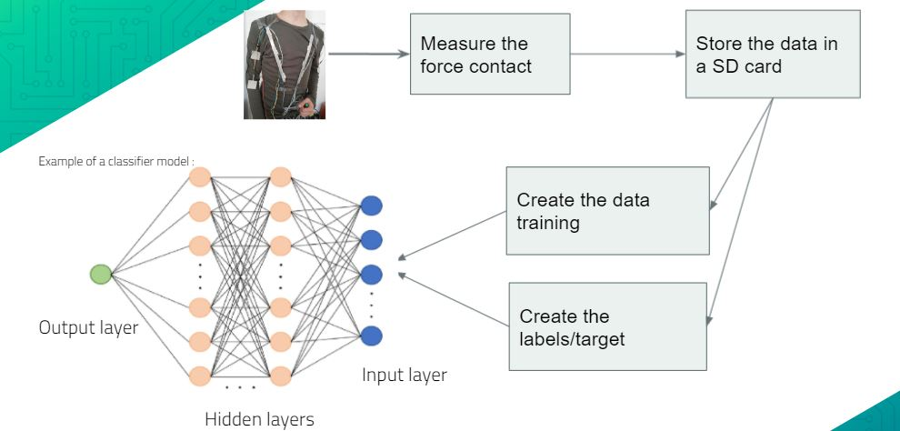
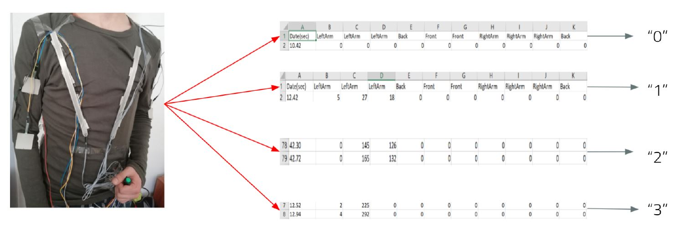

# Predictions-of-contacts-between-pedestrians
Managing pedestrian flows (in normal or non-normal periods) and minimizing the risks of jostling are major issues in the field of mobility. The goal of my internship is to develop an original device that will allow to solve this issue : a vest to measure contacts and pressures, but also distances, using force sensors as well as ultrasonic sensors.

 __1. Introduction:__

 As the world's population increases, mass gatherings such as religious or political events, air shows, rock concerts, and outdoor celebrations are becoming more frequent and attracting more and more participants from around the world. In mass gatherings, the mortality rate of crowd disasters is high. among all triggers, deaths and injuries caused by extreme densities are 23% and 35% respectively (Vanumu and Laxmikant, 2018). Therefore, in order to reduce mortality, more attention should be paid to crowd safety.

  

  __2. Overview:__

  As seen previously, the objective of this internship is to develop an original contact measurement vest using force and distance sensors in order to predict contacts and collisions between the use and pedestrians around him.
  
  __3. Functioning principle:__

The vest is also equipped with a push button control with a green LED to control the start of the recording to make the use of this vest more convenient. As soon as the user presses the push button, the LED starts to flash every 500ms which means that the measurements are correctly recorded in the SD card. SD card, if not, the LED stops flashing.
  
  __4. Binary classification:__

  the labels in the binary case are either "0" or "1". In this context "0" means that there was no contact at the time of registration and "1" otherwise. So the logic of assigning labels was as follows: as soon as there is at least one non-zero value on one of the sensors, then there was no contact and so we label=1 and 0 otherwise.

  __4.2 Random forest and cross validation:__

  We observe that the blue curve representing the training score is constant in 1. Indeed, this score is calculated using the training data so we had 0% error. However, when we used the test data, we had a fluctuation of score. Indeed, even if we increase the number of decision trees, we will have in some points an over-learning, which means that our model has learned too much the particularities of each data provided. This means that our model has learned too much about the particularities of each of the data provided. It then has a very high success rate on these training data, to the detriment of its general performance.
  
  * we obtained the triangular confusion matrix (see figure below) with 24 of mislabeled values, with an accuracy of 92%
  
  __5. Multi-class classification:__

  In this one we try to refine our predictions, so that this time we will predict if there is a contact and with what intensity (low,medium,strong). The labeling in this case will be as follows:
  * "O" : No contact
  * "1" : Low
  * "2" : Medium
  * "3" : Strong
  
  __5.2 Multi-Layer perceptrons(MLP) classifier:__

  According to the confusion matrix we obtained (see figure below), we observe that it is neither diagonal nor triangular. Indeed, we have several mislabeled values, which leads to an accuracy of 86%.
    
  Let's take for example the values 90 and 37, which means that the model is confused between medium and strong contacts. This is due to the fact that the sensors sometimes do not  give the true value of the applied force, and therefore during the labeling process, the medium contacts are considered as strong.
